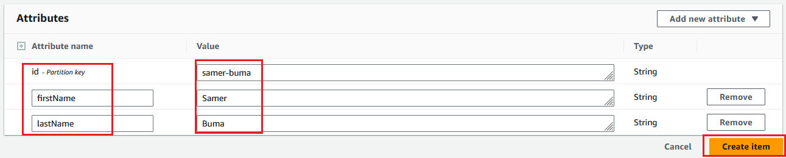
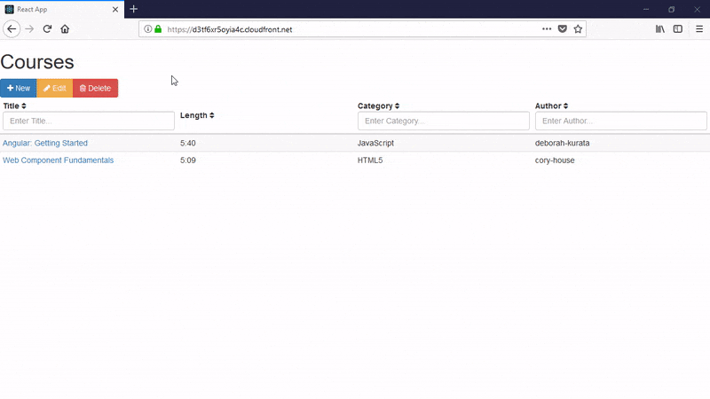

# Building a Serverless Web App on AWS Services
---
### 다이어그램


##### Refrence Link
https://www.pluralsight.com/guides/building-a-serverless-web-app-on-aws-services

#### What is API Gateway?
Amazon API Gateway는 규모와 관계없이 REST 및 WebSocket API를 생성, 게시, 유지, 모니터링 및 보호하기 위한 AWS 서비스입니다. API 개발자는 AWS 또는 다른 웹 서비스를 비롯해 AWS 클라우드에 저장된 데이터에 액세스하는 API를 생성할 수 있다. API Gateway API 개발자는 자체 클라이언트 애플리케이션에서 사용할 API를 생성할 수 있다. 또는 타사 앱 개발자가 API를 사용하도록 제공할 수도 있다.
#### What is Lambda?
Lambda는 고가용성 컴퓨팅 인프라에서 코드를 실행하고 서버와 운영 체제 유지 관리, 용량 프로비저닝 및 자동 조정, 코드 및 보안 패치 배포, 로깅 등 모든 컴퓨팅 리소스 관리를 수행한다.
#### What is DynamoDB?
Amazon DynamoDB는 완전관리형 NoSQL 데이터베이스 서비스로서 원활한 확장성과 함께 빠르고 예측 가능한 성능을 제공한다. DynamoDB는 분산 데이터베이스를 운영하고 크기 조정하는 데 따른 관리 부담을 줄여서 하드웨어 프로비저닝, 설정 및 구성, 복제, 소프트웨어 패치 또는 클러스터 크기 조정에 대해 걱정할 필요가 없게 한다. 또한 DynamoDB는 유휴 시 암호화를 제공하여 중요한 데이터 보호와 관련된 운영 부담 및 복잡성을 제거한다.
#### Serverless?
개발자가 서버를 관리할 필요 없이 애플리케이션을 빌드하고 실행할 수 있도록 하는 클라우드 네이티브 개발 모델이다. 서버리스 모델에도 서버가 존재하긴 하지만, 애플리케이션 개발에서와 달리 추상화되어 있다.

---
### Set up
우선 git clone 한다

```
git clone https://github.com/jeonilshin/serverless-web-Application.git
mv serverless-web-Application/src/* ./
```

### 구성
#### **인프라 생성**
```
aws cloudformation create-stack --stack-name skills-infra --template-body file://aws.yml --capabilities CAPABILITY_NAMED_IAM
```

#### **DynamoDB 구성**

**Console** ➡️ **DynamoDB** ➡️ **Tables**


**DynamoDB** ➡️ **Explor Items** ➡️ **authors**

**authors** 테이블에 데이터 추가한다





#### **Lambda** function 구성

##### 총 5개 Lambda function

- get-all-authors
- get-all-courses
- get-course
- update-course
- delete-course


##### **save-course** function 생성


``` index.js ```
```
const AWS = require("aws-sdk");
const dynamodb = new AWS.DynamoDB({
  region: "ap-northeast-2",
  apiVersion: "2012-08-10"
});


const replaceAll = (str, find, replace) => {
  return str.replace(new RegExp(find, "g"), replace);
};

exports.handler = (event, context, callback) => {
  const id = replaceAll(event.title, " ", "-").toLowerCase();
  const params = {
    Item: {
      id: {
        S: id
      },
      title: {
        S: event.title
      },
      watchHref: {
        S: `http://www.pluralsight.com/courses/${id}`
      },
      authorId: {
        S: event.authorId
      },
      length: {
        S: event.length
      },
      category: {
        S: event.category
      }
    },
    TableName: "courses"
  };
  dynamodb.putItem(params, (err, data) => {
    if (err) {
      console.log(err);
      callback(err);
    } else {
      callback(null, {
        id: params.Item.id.S,
        title: params.Item.title.S,
        watchHref: params.Item.watchHref.S,
        authorId: params.Item.authorId.S,
        length: params.Item.length.S,
        category: params.Item.category.S
      });
    }
  });
};
```


함수들은 다 구성되었으니 REST API 통해 함수들을 노출시켜 보자

### **API Gateway** 구성

**Console** ➡️ **API Gateway** ➡️ **REST API**


courses 리소스를 생성한다


Options 엔드포인트가 생성되는 이유는 클라이언트가 사전 요청(pre-flight request)을 보내서 해당 리소스가 사용 가능하며 CORS 헤더를 포함하는지 확인하기 위해서


"/courses" 엔드포인트에 메서드를 추가하려면 해당 엔드포인트를 선택한 후 (루트 / 엔드포인트를 선택하지 않고) "작업" 메뉴를 열고 "메서드 생성" 옵션을 클릭한다


POST 메서드


```
{
  "$schema": "http://json-schema.org/schema#",
  "title": "CourseInputModel",
  "type": "object",
  "properties": {
    "title": {"type": "string"},
    "authorId": {"type": "string"},
    "length": {"type": "string"},
    "category": {"type": "string"}
  },
  "required": ["title", "authorId", "length", "category"]
}
```


POST test
```
{
  "title": "Web Component Fundamentals",
  "authorId": "cory-house",
  "length": "5:03",
  "category": "HTML5"
}
```

PUT 메서드


우리는 courses/web-component-fundamentals와 같은 경로가 필요할 것이다. 여기서 web-component-fundamentals는 우리가 업데이트하거나 삭제하거나 선택하려는 강좌의 ID에 해당한다


```
{
  "id": $input.params('id'),
  "title" : $input.json('$.title'),
  "authorId" : $input.json('$.authorId'),
  "length" : $input.json('$.length'),
  "category" : $input.json('$.category'),
  "watchHref" : $input.json('$.watchHref')
}
```

PUT test
``` web-component-fundamentals ```
```
{
  "title": "Web Component Fundamentals",
  "authorId": "cory-house",
  "length": "5:03",
  "category": "HTML5",
  "watchHref": "http://www.pluralsight.com/courses/web-components-shadow-dom"
}
```


기존의 지식을 활용하여, 다음 템플릿을 사용하여 /courses/{id} 리소스에 DELETE 및 GET 메서드를 생성하고, 각각 delete-course 및 get-course 함수에 연결하고 ID만 전달하도록 구성해보자
```
{
  "id": "$input.params('id')"
}
```

"get-all-courses" 함수에 대한 /courses 리소스에 GET 메서드를 추가하는 것을 잊지 말고, "get-all-authors" 함수에 대한 /authors 리소스도 추가 한다

작업이 끝나면 아래와 같은 구조가 된다:


### Cross Origin Resource Sharing (CORS)


OPTION을 비활성화 한다


/courses과 /courses/{id}도 마찬가지 CORS 설정한다

배포:


예를 들어, API의 루트 URL이 다음과 같다
``` https://7zq756fbrb.execute-api.ap-northeast-2.amazonaws.com/v1 ``` 그리고 ``` https://7zq756fbrb.execute-api.ap-northeast-2.amazonaws.com/v1/courses/web-component-fundamentals ```

### POSTMAN 또는 CURL로 확인


### Hosting the app in S3

src/api/serverUrl.js 파일로 이동하신 후, 내보낸 값(value)을 여러분의 API의 URL로 수정한다


```
{
  "Id": "Policy1691754856108",
  "Version": "2012-10-17",
  "Statement": [
    {
      "Sid": "Stmt1691754855144",
      "Action": "s3:*",
      "Effect": "Allow",
      "Resource": "버킷 ARN/*",
      "Principal": "*"
    }
  ]
}
```

무선 src/s3에 있는 폴더과 파일들을 ``` Build ``` 한다. ``` npm install ``` 하고 ``` npm run build ``` 한다

build 성공하면 ``` Build ``` 폴더가 생긴다. Build에 있는 모든 파일과 폴더를 S3에 업로드한다.


업로드 후 s3 static website에 제공된 URL를 Firefox나 Chrome에 접속한다


### Cloudfront 구성

**Console** ➡️ **Cloudfront**


### WEB APP TEST



### Conclusion

The idea of a serverless application is interesting:

- There's no need to manage any servers.
- The application can be scaled automatically and highly available.
- You pay only for the resources used and for the time the application is used.

In this tutorial, you have learned how to use AWS's API Gateway and Lambda functions to build a REST API that performs CRUD operations on a database built on the AWS DynamoDB database framework. This guide also covered how to host this API on S3 in a single-page application that can be distributed worldwide using CloudFront.

This was just a cursory look at each of these technologies; there is a lot more to learn about each technology and about other AWS components as well!

In case AWS excites you, some interesting projects would include authenticating users with Amazon Cognito or using a framework like Serveless or a service like AWS CloudFormation to simplify the managing and deploying of serverless applications.

